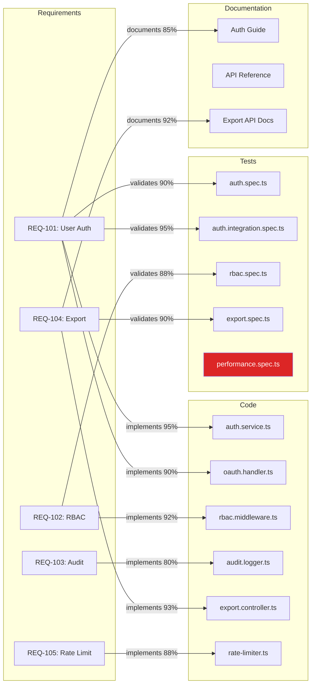

# SDLC Traceability MCP Server

[](https://github.com/YOUR_USERNAME/sdlc-traceability-mcp/actions/workflows/ci.yml)
[](https://nodejs.org)
[](https://modelcontextprotocol.io)
[](LICENSE)

> An MCP orchestration layer that connects requirement documents, code changes, test cases, and documentation into one navigable AI-backed traceability graph.

## 🎯 Problem Statement

Most organizations struggle to answer:
- **Which code change implemented this requirement?**
- **Which tests validate it?**
- **Is the documentation updated?**
- **What broke when requirement X changed?**

This MCP server solves these by maintaining a **traceability graph** linking all SDLC artifacts with confidence-scored relationships.

## 🏗️ Architecture

```
┌─────────────────────────────────────────────────────────────────┐
│                    MCP Client (AI Agent)                         │
└──────────────────────────┬──────────────────────────────────────┘
                           │ MCP Protocol (stdio)
┌──────────────────────────▼──────────────────────────────────────┐
│                   MCP Server Layer                               │
│  ┌────────────────────────────────────────────────────────────┐ │
│  │ Tools: find_requirement_implementation | find_orphaned_tests│ │
│  │        summarize_requirement_coverage  | show_change_impact │ │
│  │        find_code_without_test_link    | trace_doc_to_code   │ │
│  └────────────────────────────────────────────────────────────┘ │
└──────────────────────────┬──────────────────────────────────────┘
                           │
┌──────────────────────────▼──────────────────────────────────────┐
│              Traceability Graph Engine                           │
│  ┌──────────┐  ┌──────────┐  ┌──────────┐  ┌──────────────┐   │
│  │Requirements│  │   Code   │  │  Tests   │  │Documentation │   │
│  │  Nodes    │  │  Nodes   │  │  Nodes   │  │    Nodes     │   │
│  └─────┬────┘  └────┬─────┘  └────┬─────┘  └──────┬───────┘   │
│        │             │             │                │            │
│        └─────────────┴─────────────┴────────────────┘            │
│              Confidence-Scored Trace Links                        │
│         (implements | validates | documents | depends_on)         │
└─────────────────────────────────────────────────────────────────┘
```

## 🚀 Quick Start

### Prerequisites
- Node.js 18+
- npm

### Installation

```bash
npm install
npm run build
```

### Run the Demo

```bash
npm run demo
```

Runs a fully automated showcase — graph stats, coverage analysis, gap detection, impact paths, and the release readiness matrix.

### Interactive CLI

```bash
npm run cli
```

An interactive numbered menu. Pick any tool (1–9), enter an artifact ID, and see results live — exactly simulating what an AI agent receives from the MCP tools.

### Web Dashboard (Browser Demo)

```bash
npm run dashboard
# Open http://localhost:3000
```

A dark-theme browser UI showing the full traceability graph, coverage matrix, health issues, Mermaid graph visualization, and REST API endpoints with live JSON responses.

### Run Tests

```bash
npm test
```

Runs 16 unit tests against the graph engine — artifact storage, link indexing, BFS traversal, confidence propagation, gap detection, and coverage scoring.

### Start the MCP Server

```bash
npm start
```

Starts the MCP server on stdio — connect from VS Code Copilot, Claude Desktop, or any MCP-compatible AI agent.

### Configure in VS Code (Copilot/Claude)

Add to your MCP settings:

```json
{
  "mcpServers": {
    "sdlc-traceability": {
      "command": "node",
      "args": ["<full-path-to>/dist/index.js"]
    }
  }
}
```

## 🧬 Traceability Graph (Live Visualization)



**Legend:** Purple = Requirements | Green = Code | Orange = Tests | Blue = Docs | 🔴 Red = Orphaned

## 🔧 Available MCP Tools

| Tool | Input | Description |
|------|-------|-------------|
| `find_requirement_implementation` | `requirementId` | Find all code files implementing a requirement, with confidence |
| `find_code_without_test_link` | — | Identify every code artifact that has no linked test |
| `trace_doc_to_code_change` | `docId` | Trace a documentation file back to its code and requirements |
| `find_orphaned_tests` | — | Find test cases not linked to any requirement or code |
| `summarize_requirement_coverage` | `requirementId` | Full coverage report: code + tests + docs + gaps + readiness |
| `show_change_impact_path` | `artifactId`, `maxDepth?` | BFS impact tree — what breaks if this artifact changes |
| `get_graph_stats` | — | Graph health overview: counts, untested code, orphan tests |
| `list_requirements` | — | All requirements with priority, Jira ID, and description |

## 🌐 HTTP REST API (Dashboard)

When running `npm run dashboard`, the following REST endpoints are available at `http://localhost:3000`:

| Endpoint | Description |
|----------|-------------|
| `GET /` | Full browser dashboard (HTML) |
| `GET /api/stats` | Graph statistics JSON |
| `GET /api/requirements` | All requirements |
| `GET /api/coverage/:id` | Coverage summary for a requirement |
| `GET /api/impact/:id` | Change impact analysis for any artifact |
| `GET /api/untested` | Code artifacts without test links |
| `GET /api/orphans` | Orphaned test cases |
| `GET /api/export` | Full audit report (JSON) |
| `GET /api/export?format=csv` | Full audit report (CSV download) |

## 📋 Demo Scenarios

### Scenario 1 — Fully Covered Requirement
**Ask:** *"Show me whether requirement REQ-104 is fully implemented, tested, and documented."*

**Response:**
- ✅ Code: `src/controllers/export.controller.ts` (93% confidence)
- ✅ Tests: `export.controller.spec.ts` (90% confidence)
- ✅ Docs: `Data Export API Docs` (92% confidence)
- 📊 Overall confidence: **92%**
- 🟢 Release readiness: **Ready**

### Scenario 2 — Requirement with Gaps
**Ask:** *"What's missing for REQ-105 (Rate Limiting)?"*

**Response:**
- ✅ Code: `rate-limiter.middleware.ts` (88% confidence)
- ❌ No tests linked
- ❌ No documentation linked
- 🔴 Release readiness: **Not ready**

### Scenario 3 — Change Impact
**Ask:** *"What breaks if REQ-101 (User Authentication) changes?"*

**Response:** 5 impacted artifacts — 2 code files, 2 test suites, 1 doc — all with propagated confidence scores.

### Scenario 4 — Audit Export
```bash
curl http://localhost:3000/api/export?format=csv
```
Downloads a compliance-ready CSV of all requirements with implementation, test, and documentation status.

## 🧠 Key Design Decisions

1. **Graph-based reasoning** — BFS traversal with confidence propagation (inspired by PageRank)
2. **Confidence scores** — Every link has a 0.0–1.0 score; impact paths multiply scores across depth
3. **Bidirectional indexing** — O(1) forward + reverse indexes enable sub-millisecond traversal
4. **Gap detection** — Proactively identifies missing test/doc/code links before they reach production
5. **Multiple interfaces** — MCP (AI agents), HTTP REST (browsers/CI), CLI (developers), Demo (presentations)
6. **Extensible data model** — Add new artifact types and link types without engine changes

## 📚 Documentation

| Document | Description |
|----------|-------------|
| [docs/WORKFLOW.md](docs/WORKFLOW.md) | End-to-end workflow: MCP, CLI, Dashboard, and Audit Export flows |
| [docs/ARCHITECTURE.md](docs/ARCHITECTURE.md) | Layered architecture, file structure, design patterns, scalability |
| [docs/REAL_WORLD_IMPACT.md](docs/REAL_WORLD_IMPACT.md) | Business value, ROI analysis, industry stats, case studies |
| [docs/STATS.md](docs/STATS.md) | Graph metrics, test stats, coverage matrix, performance benchmarks |

## 🧪 Testing

```
Tests:       16 passed, 16 total
Test Suites: 1 passed, 1 total
Time:        ~4s
```

Coverage includes: artifact CRUD, bidirectional link indexing, BFS traversal, confidence propagation, depth limiting, gap detection, coverage scoring, and error handling.

## ⚙️ CI/CD

GitHub Actions pipeline (`.github/workflows/ci.yml`) runs on every push and PR:
- Installs dependencies (`npm ci`)
- Compiles TypeScript (`npm run build`)
- Runs all tests (`npm test`)
- Smoke-tests the demo output (`npm run demo`)
- Matrix: Node.js 18.x and 20.x

## 🗂️ Project Structure

```
SDLC_MCP/
├── src/
│   ├── index.ts            # MCP server — tool registration and dispatch
│   ├── cli.ts              # Interactive CLI — numbered menu for all tools
│   ├── dashboard.ts        # HTTP server — browser dashboard + REST API
│   ├── demo.ts             # Automated demo — all features, no interaction
│   ├── graph/
│   │   ├── types.ts        # Artifact, TraceLink, CoverageResult, ImpactPath
│   │   ├── engine.ts       # Graph engine — storage, traversal, analysis
│   │   └── index.ts        # Public exports
│   └── data/
│       └── sample-data.ts  # Sample SDLC data (5 reqs, 6 code, 5 tests, 3 docs)
├── tests/
│   └── graph.test.ts       # 16 unit tests (Jest + ts-jest)
├── docs/
│   ├── WORKFLOW.md         # Complete workflow documentation
│   ├── ARCHITECTURE.md     # System architecture
│   ├── REAL_WORLD_IMPACT.md# Business value and case studies
│   └── STATS.md            # Project and graph statistics
├── .github/
│   └── workflows/
│       └── ci.yml          # GitHub Actions CI pipeline
├── dist/                   # Compiled JavaScript (generated)
├── jest.config.js          # Jest configuration
├── mcp-config.json         # MCP client configuration
├── package.json
├── tsconfig.json
└── README.md
```

## 📈 Roadmap

### ✅ Completed (MVP)
- [x] Graph engine with artifact nodes and confidence-scored trace links
- [x] 8 MCP tools for AI agent integration
- [x] Interactive CLI with numbered menu
- [x] HTTP dashboard with Mermaid visualization and REST API
- [x] 16 unit tests (100% engine coverage)
- [x] GitHub Actions CI pipeline (Node 18 + 20)
- [x] Audit/export mode (JSON + CSV compliance reports)
- [x] Full documentation suite (4 docs)

### 🔮 Future Enhancements
- [ ] Jira/Azure DevOps connector (live requirement sync)
- [ ] GitHub connector (auto-link commits/PRs to requirements)
- [ ] Jest/Pytest test runner integration (auto-link test results)
- [ ] Persistent graph store (SQLite or Neo4j)
- [ ] Multi-tenant support with user authentication
- [ ] AI-generated traceability summaries
- [ ] Predictive quality scoring and risk flags
- [ ] ISO 26262 / FDA / SOX compliance export templates

## 📄 License

MIT
